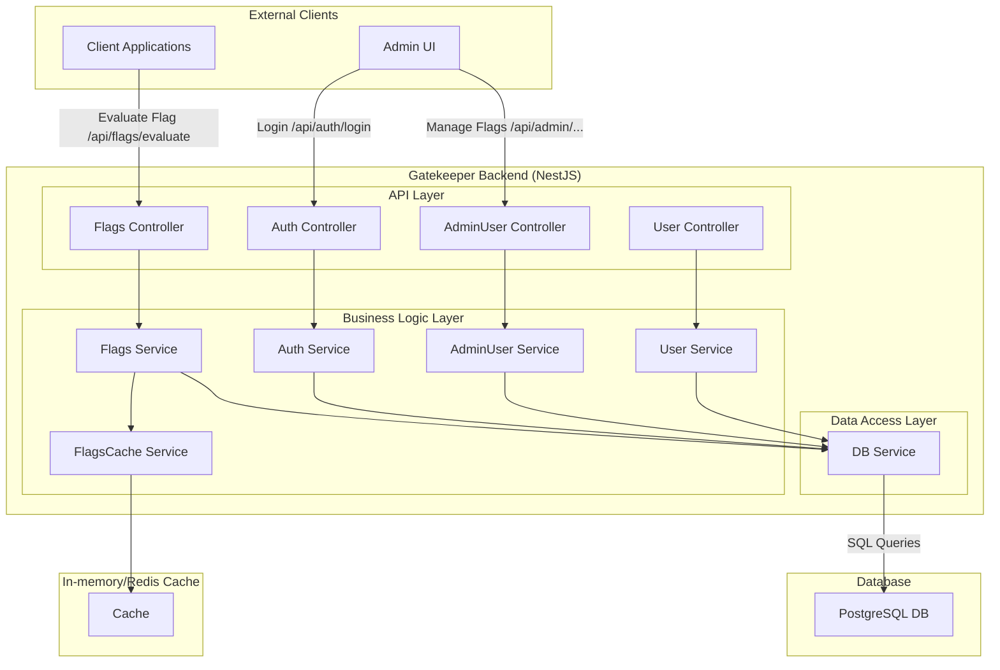

```mermaid
graph TD
    subgraph "External Clients"
        Client[Client Applications]
        Admin[Admin UI]
    end

    subgraph "Gatekeeper Backend (NestJS)"
        subgraph "API Layer"
            AuthController[Auth Controller]
            FlagsController[Flags Controller]
            AdminController[AdminUser Controller]
            UserController[User Controller]
        end

        subgraph "Business Logic Layer"
            AuthService[Auth Service]
            FlagsService[Flags Service]
            AdminUserService[AdminUser Service]
            UserService[User Service]
            FlagsCache[FlagsCache Service]
        end

        subgraph "Data Access Layer"
            DbService[DB Service]
        end
    end

    subgraph "Database"
        Postgres[PostgreSQL DB]
    end

    subgraph "In-memory/Redis Cache"
        Cache[Cache]
    end

    Client -- "Evaluate Flag /api/flags/evaluate" --> FlagsController
    Admin -- "Login /api/auth/login" --> AuthController
    Admin -- "Manage Flags /api/admin/..." --> AdminController

    FlagsController --> FlagsService
    AuthController --> AuthService
    AdminController --> AdminUserService
    UserController --> UserService

    FlagsService --> FlagsCache
    FlagsCache --> Cache
    FlagsService --> DbService
    AuthService --> DbService
    AdminUserService --> DbService
    UserService --> DbService

    DbService -- "SQL Queries" --> Postgres
```
