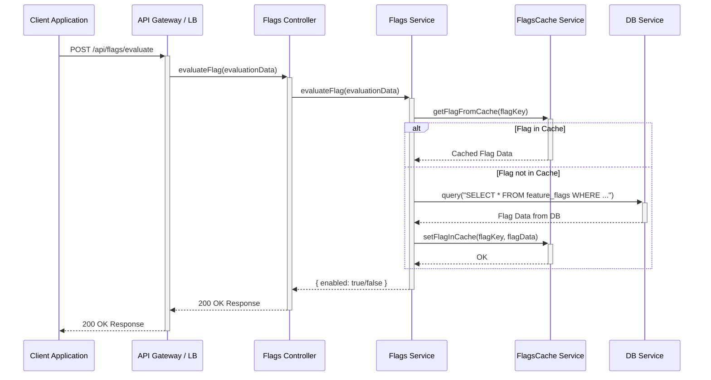

```mermaid
sequenceDiagram
    participant ClientApp as Client Application
    participant Gateway as API Gateway / LB
    participant FlagsController as Flags Controller
    participant FlagsService as Flags Service
    participant FlagsCache as FlagsCache Service
    participant DbService as DB Service

    ClientApp->>+Gateway: POST /api/flags/evaluate
    Gateway->>+FlagsController: evaluateFlag(evaluationData)
    FlagsController->>+FlagsService: evaluateFlag(evaluationData)
    FlagsService->>+FlagsCache: getFlagFromCache(flagKey)
    alt Flag in Cache
        FlagsCache-->>-FlagsService: Cached Flag Data
    else Flag not in Cache
        FlagsService->>+DbService: query("SELECT * FROM feature_flags WHERE ...")
        DbService-->>-FlagsService: Flag Data from DB
        FlagsService->>+FlagsCache: setFlagInCache(flagKey, flagData)
        FlagsCache-->>-FlagsService: OK
    end
    FlagsService-->>-FlagsController: { enabled: true/false }
    FlagsController-->>-Gateway: 200 OK Response
    Gateway-->>-ClientApp: 200 OK Response
```
